# Windows 下安装 OpenClaw 操作手册

> 本手册详细说明在 Windows 系统上安装 OpenClaw 的完整步骤

---

## 目录

1. [前置要求](#1-前置要求)
2. [安装步骤](#2-安装步骤)
3. [首次配置](#3-首次配置)
4. [验证安装](#4-验证安装)
5. [连接飞书](#5-连接飞书)
6. [卸载说明](#6-卸载说明)
7. [附录](#7-附录)

---

## 1. 前置要求

### 1.1 系统要求

| 要求 | 详情 |
|------|------|
| 操作系统 | Windows 10/11 |
| Node.js | 版本 22 或更高 |
| PowerShell | 版本 5.0 或更高 |
| 网络 | 需要互联网连接 |

### 1.2 检查环境

在安装前，先检查你的环境：

```powershell
# 检查 Node.js 版本
node --version

# 检查 npm 版本
npm --version

```

如果 Node.js 未安装，需要安装node。

官网地址: https://nodejs.org/en/download

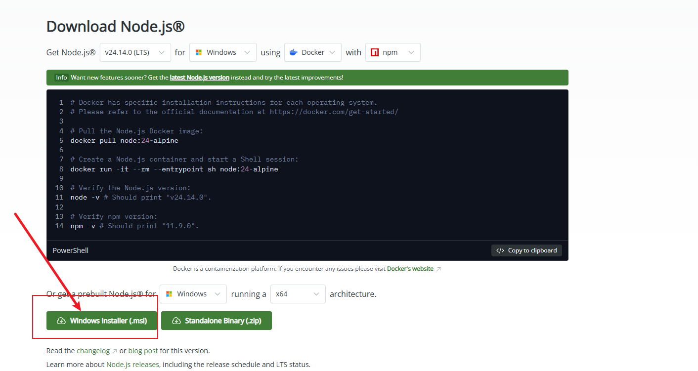

---

## 2. 安装步骤

### 2.1 安装 OpenClaw

打开 **PowerShell**（右键开始菜单 → Windows PowerShell），执行以下命令：

```powershell
npm i -g openclaw
# 或者
npm install -g openclaw@latest
# 或者
iwr -useb https://openclaw.ai/install.ps1 | iex
```

安装完成后，验证是否成功：

```powershell
openclaw --version
```

应该输出类似：
```
🦞 OpenClaw 2026.3.2 (85377a2)
```

---

## 3. 首次配置

### 3.1 运行配置向导

执行以下命令启动配置向导：

```powershell
openclaw onboard --install-daemon
```

---

### 3.2 配置步骤

#### Step 1: 风险提示

风险提示，直接选择 **Yes**

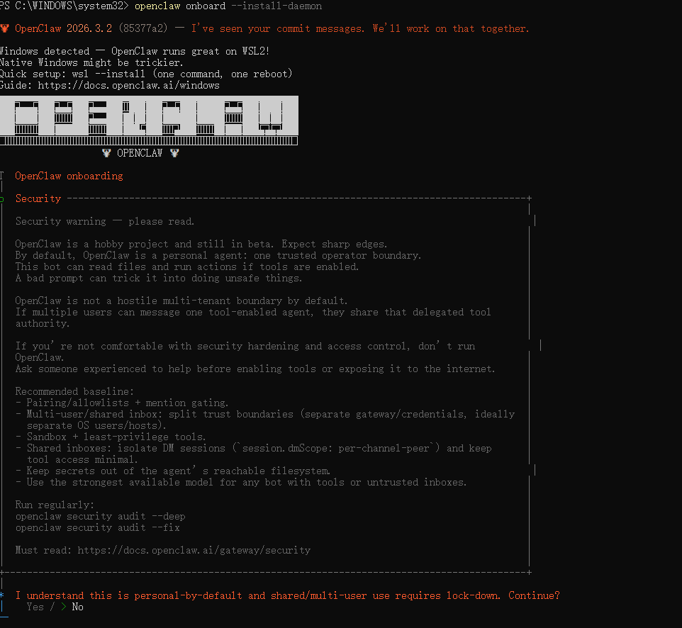

---

#### Step 2: 选择模式Start (快速开始

- **Quick)**: 使用默认配置
- **Manual (手动配置)**: 自定义所有选项

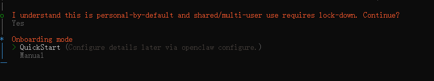

> 💡 **建议**: 初学者选择 QuickStart，本手册选择 Manual 进行详细说明

---

#### Step 3: 选择启动本地网关

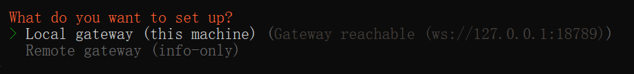

---

#### Step 4: 设置工作区

- 默认: `~/.openclaw/workspace`
- 可以自定义路径

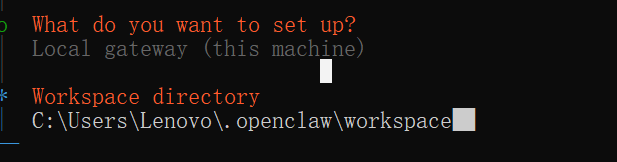

---

#### Step 5: 选择模型供应商

选择推荐的 **MiniMax**

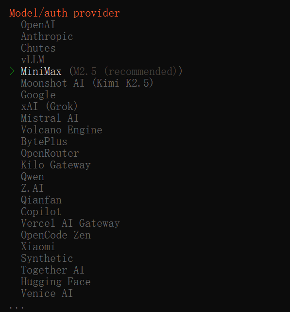

认证方式选择 **OAuth**

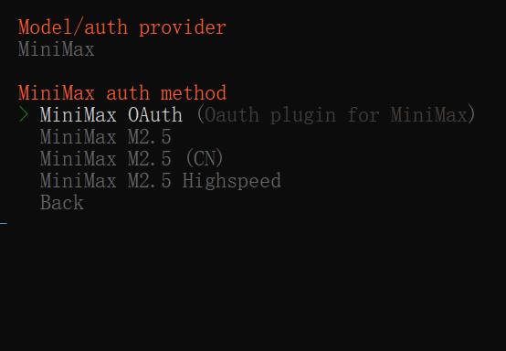

选择 **CN**，完成后会跳转到 Minimax 网站授权，选择授权即可

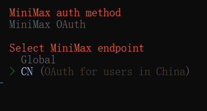


授权完成后，选择大模型，默认即可

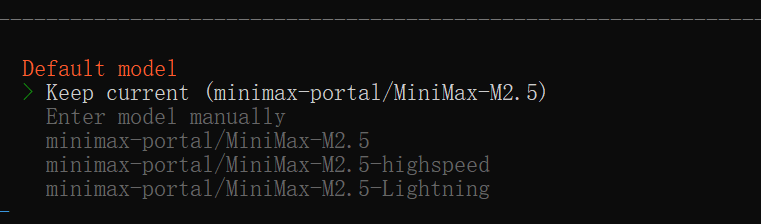

---

#### Step 6: 配置 Gateway

| 选项 | 默认值 | 说明 |
|------|--------|------|
| Port | 18789 | Gateway 端口 |
| Bind | loopback | 绑定地址 |
| Auth Mode | token | 认证模式 |
| Tailscale | off | 内网穿透 |

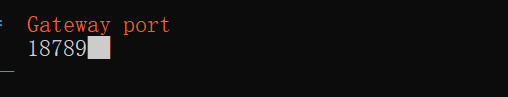

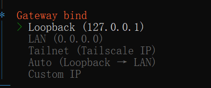

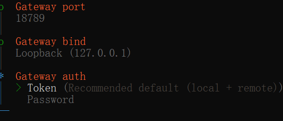

---

#### Step 7: 连接频道（可选）

这里先不做配置，后面会单独配置飞书


可选频道：
- 📱 WhatsApp
- ✈️ Telegram
- 💬 Discord
- 📱 Signal
- 🦞 飞书

---

#### Step 8: 安装 Skills

跳过，不安装。选择 **No**


---

#### Step 9: Hooks

跳过，按空格键选择，再按回车确认

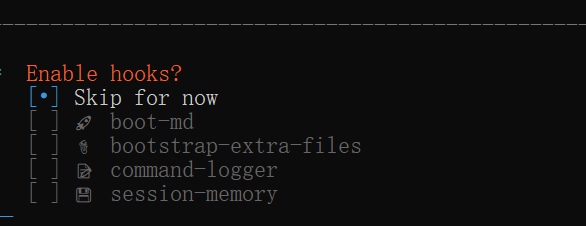

---

#### Step 10: 启动网关

向导会自动启动 Gateway 并验证是否正常运行

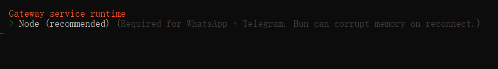

选择 **Open the Web UI**，会在浏览器中打开

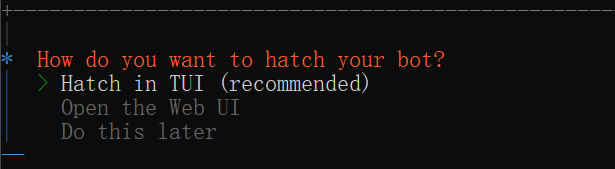

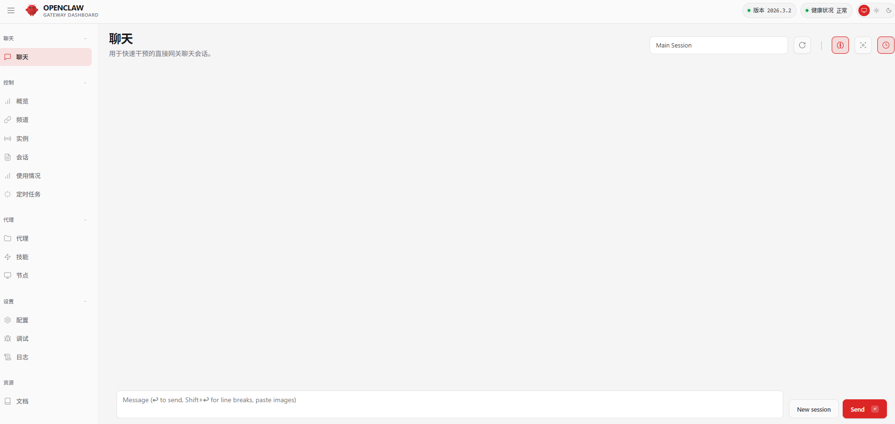

---

## 4. 验证安装

### 4.1 检查 Gateway 状态

```powershell
openclaw gateway status
```

### 4.2 打开控制台 UI

```powershell
openclaw dashboard
```

这会在浏览器中打开控制台界面，可以在其中直接与 Agent 聊天。

### 4.3 检查状态

```powershell
openclaw status
```

---

## 5. 连接飞书

### 5.1 创建飞书应用

1. 进入飞书开放平台：https://open.feishu.cn/
2. 点击进入开发者后台：https://open.feishu.cn/app
3. 创建自建应用


---

### 5.2 添加机器人

点击添加机器人


---

### 5.3 配置权限

配置权限，选择 **批量导入**

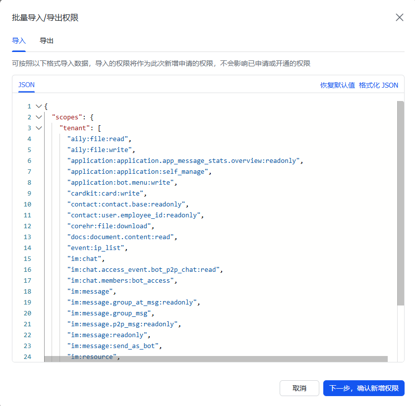

填入以下内容，并确认申请开通：

```json
{
  "scopes": {
    "tenant": [
      "aily:file:read",
      "aily:file:write",
      "application:application.app_message_stats.overview:readonly",
      "application:application:self_manage",
      "application:bot.menu:write",
      "cardkit:card:write",
      "contact:contact.base:readonly",
      "contact:user.employee_id:readonly",
      "corehr:file:download",
      "docs:document.content:read",
      "event:ip_list",
      "im:chat",
      "im:chat.access_event.bot_p2p_chat:read",
      "im:chat.members:bot_access",
      "im:message",
      "im:message.group_at_msg:readonly",
      "im:message.group_msg",
      "im:message.p2p_msg:readonly",
      "im:message:readonly",
      "im:message:send_as_bot",
      "im:resource",
      "sheets:spreadsheet",
      "wiki:wiki:readonly"
    ],
    "user": ["aily:file:read", "aily:file:write", "im:chat.access_event.bot_p2p_chat:read"]
  }
}
```

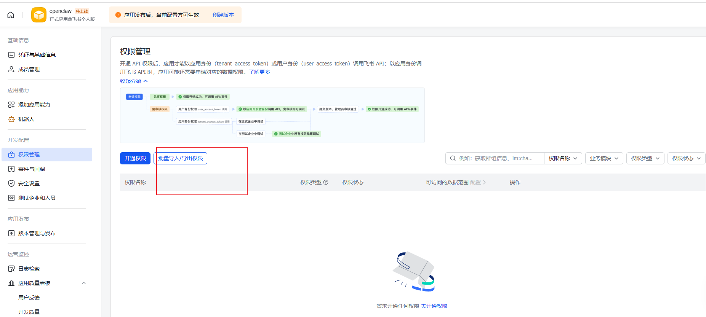

---

### 5.4 发布版本

创建并发布版本

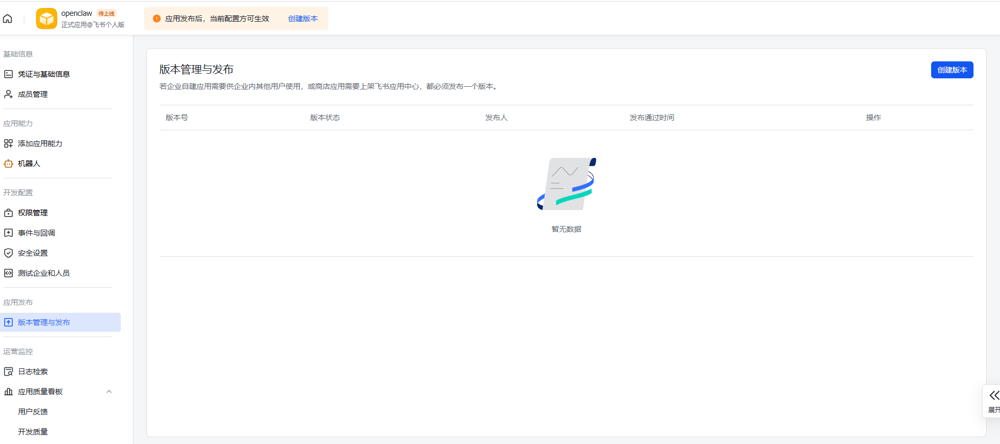

发布成功后，查看 **App ID** 和 **密钥**，后面要用

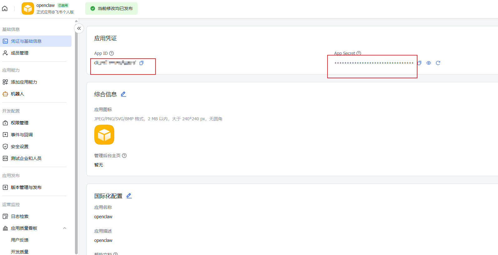

---

### 5.5 配置 OpenClaw Channel

手动配置时，配置 channel 的地方选择飞书，后面会让你输入密钥和 App ID，复制上边的值就可以

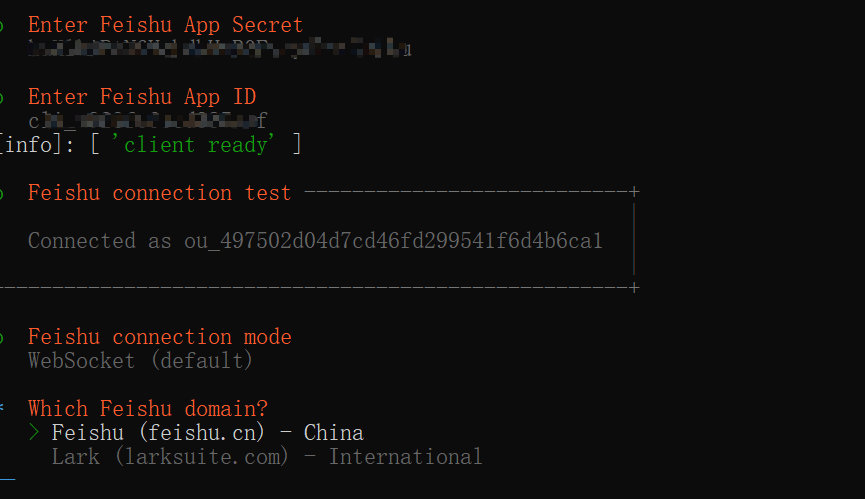

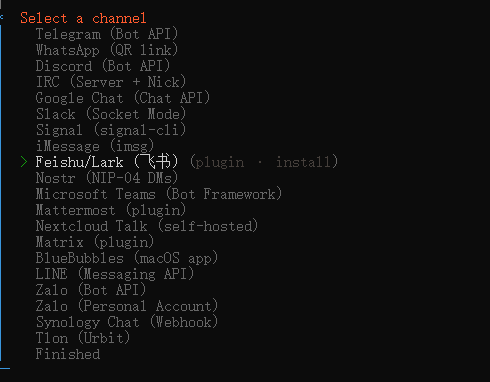

最后配置到

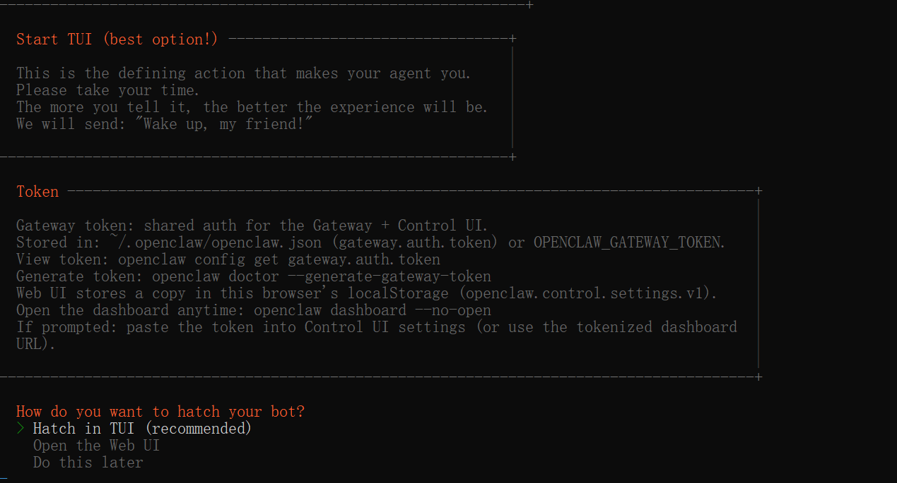

---

### 5.6 配置事件

> ⚠️ **重要提示**: 一定要先配置好飞书的 channel 后再添加事件！

选择保存时会提示，这里说明 OpenClaw 那里没有配置好飞书的 channel

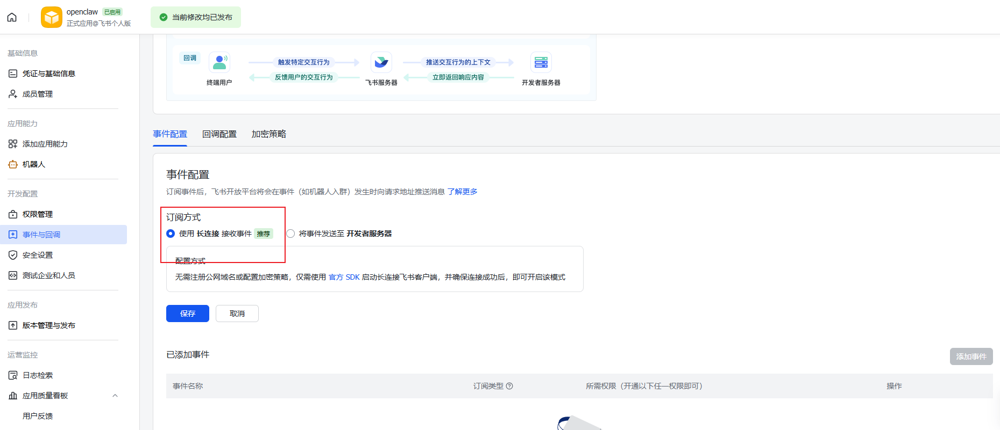


添加下面这个事件并保存

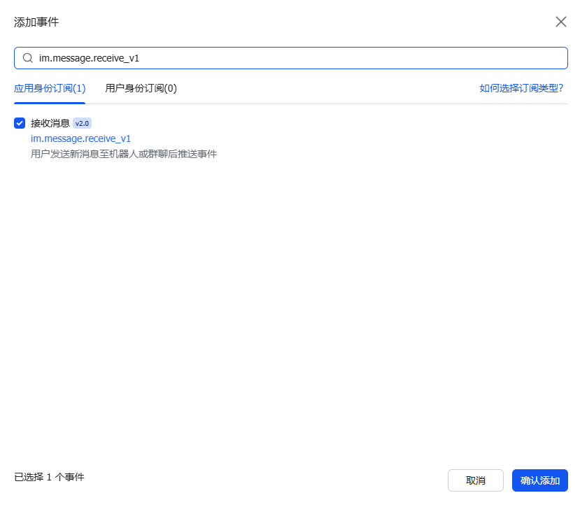

> 🔔 **重要**: 以上配置好后再发布一个版本即可使用飞书交互

---

### 5.7 完成配置

复制配对命令，执行配置

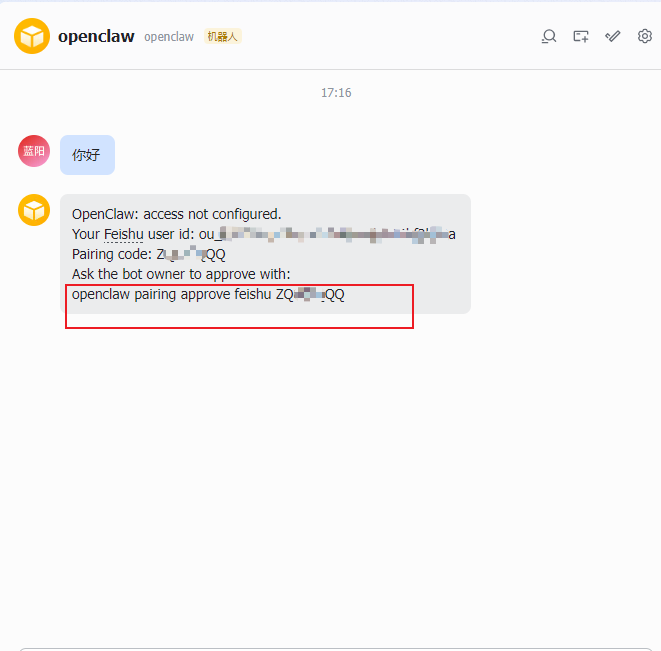

再聊天就可以正常收发消息了


---

## 6. 卸载说明

如果需要卸载 OpenClaw，执行以下命令：

```powershell
openclaw uninstall
```

---

## 7. 附录

### 常用命令汇总

| 命令 | 说明 |
|------|------|
| `openclaw --version` | 查看版本 |
| `openclaw dashboard` | 打开控制台 UI |
| `openclaw gateway status` | 查看 Gateway 状态 |
| `openclaw status` | 查看整体状态 |
| `openclaw doctor` | 健康检查 |
| `openclaw config show` | 查看配置 |
| `openclaw message send` | 发送消息 |

### 配置文件的路径


| 文件 | 路径 |
|------|------|
| 配置文件 | `C:\Users\<用户名>\.openclaw\openclaw.json` |
| 工作区 | `C:\Users\<用户名>\.openclaw\workspace` |

### 相关链接

官网: https://openclaw.ai/

官方文档: https://docs.openclaw.ai/

中文社区: https://clawd.org.cn/

skill市场: https://clawhub.ai/

github开源skill: https://github.com/VoltAgent/awesome-openclaw-skills

---

> 📝 手册版本: 2026.3.2  
> 最后更新: 2026-03-05
